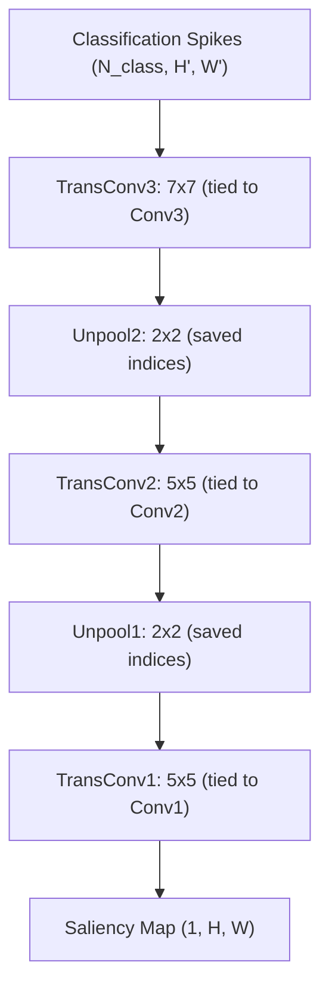

# Decoder Network

The decoder maps classification spikes back to pixel space using **transposed convolutions with tied weights** from the encoder and max unpooling with saved indices [2].

## Data Flow



## Tied Weights

Each transposed convolution reuses the **transposed kernel** from the corresponding encoder layer. This means the decoder has **no additional learnable parameters** -- it is fully determined by the encoder.

```python
decoder = SpikeSEGDecoder.from_encoder(encoder)
```

## Unpooling

Max unpooling places each value back at the position of the original max-pooling winner using the stored indices. All other positions are filled with zeros, preserving spatial precision.

## Delay Connections

An optional `DelayConnection` module maintains spike continuity across timesteps by buffering previous activations with exponential decay. This is controlled by `DecoderConfig.use_delay_connections` (default: `True`).

## Single-Spike Decoding

The decoder can also decode a **single classification spike** at a given spatial location (used by HULK):

```python
mask = decoder.decode_single_spike(
    spike_location=(y, x),
    class_id=0,
    batch_size=1,
    class_spatial_shape=(H_cls, W_cls),
    pool1_indices=...,
    pool2_indices=...,
    pool1_output_size=...,
    pool2_output_size=...,
)
```

See [HULK-SMASH](hulk-smash) for how this enables instance segmentation.
