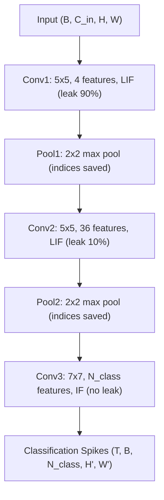

# Encoder Network

The encoder extracts hierarchical spatio-temporal features through three spiking convolutional layers with interleaved max pooling.

## Data Flow



## Layer Specifications

| Property | Conv1 | Conv2 | Conv3 |
|----------|-------|-------|-------|
| Kernel | 5x5 | 5x5 | 7x7 |
| Output channels | 4 | 36 | $n_\text{classes}$ |
| Neuron | LIF (subtractive) | LIF (subtractive) | IF |
| Threshold $\theta$ | 10.0 | 10.0 | 10.0 |
| Leak $\lambda$ | 9.0 (90%) | 1.0 (10%) | 0.0 |
| Trained by | Fixed DoG/Gabor | STDP + WTA | STDP |
| Weight init | $\mathcal{N}(0.8, 0.01)$ | $\mathcal{N}(0.8, 0.01)$ | $\mathcal{N}(0.8, 0.01)$ |

## Spiking Convolution

At layer $l$, the input current arriving at neuron $(c, h, w)$ is:

$$
I_l[c, h, w] = \sum_{c'} \sum_{k_h} \sum_{k_w} W_l[c, c', k_h, k_w] \cdot S_{l-1}[c', h + k_h, w + k_w]
$$

$S_{l-1}$ is the binary spike tensor from the previous layer; weights $W_l \in [0, 1]$.

## Pooling

Max pooling selects the highest activation and stores the winning index for the decoder:

$$
y[c, h, w],\; \text{idx}[c, h, w] = \max_{(k_h, k_w) \in \mathcal{K}} x[c, h \cdot s + k_h, w \cdot s + k_w]
$$

## EncoderOutput

The encoder returns an `EncoderOutput` dataclass:

| Field | Type | Description |
|-------|------|-------------|
| `classification_spikes` | `Tensor` | Spikes from Conv3 (T, B, C, H', W') |
| `pooling_indices` | `PoolingIndices` | Pool1/Pool2 indices and output sizes |
| `layer_spikes` | `Dict[str, Tensor]` | Spikes at each layer (`conv1`, `conv2`, `conv3`) |
| `layer_spike_times` | `Dict[str, Tensor]` | First-spike times per layer |
| `has_spikes` | `bool` | Whether any classification spikes occurred |
| `n_classification_spikes` | `int` | Total classification spike count |

## Paper Presets

```python
from spikeseg.models import SpikeSEGEncoder
from spikeseg.models.encoder import EncoderConfig

# IGARSS 2023 configuration
config = EncoderConfig.from_paper("igarss2023", n_classes=1)
encoder = SpikeSEGEncoder(config)
```

See [API: Models](../api/models) for all constructor parameters.
