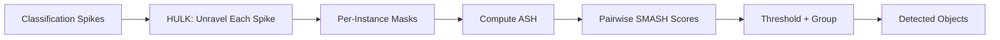

# HULK-SMASH Instance Segmentation

The HULK-SMASH algorithm [3] extends semantic segmentation to **instance segmentation** by decoding each classification spike separately and then grouping related instances into objects.

## Algorithm Pipeline



## Step 1: HULK -- Hierarchical Unravelling of Linked Kernels

Instead of feeding all classification spikes through the decoder at once, HULK decodes **each spike individually**:

1. Create a one-hot activation at the spike's spatial location in classification space.
2. Pass it through the decoder (TransConv3 &rarr; Unpool2 &rarr; TransConv2 &rarr; Unpool1 &rarr; TransConv1).
3. The output is a pixel mask showing which input pixels contributed to that detection.
4. Record intermediate spike activity at each decoder layer.

> *"The Hierarchical Unravelling of Linked Kernels (HULK) process permits spiking activity from the classification convolution layer to be tracked as it propagates through the decoding layers."* [3]

## Step 2: ASH -- Active Spike Hashing

The intermediate spike activity from HULK is a 4D tensor $(x, y, f, t)$. ASH compresses this into a 2D binary matrix indexed by **(feature, timestep)**:

$$
\text{ASH}[f, t] = \begin{cases} 1 & \text{if feature } f \text{ fired at timestep } t \\ 0 & \text{otherwise} \end{cases}
$$

This discards spatial detail but preserves the *featural-temporal fingerprint* of each instance.

## Step 3: SMASH -- Similarity Matching through Active Spike Hashing

The SMASH score between two instances $i$ and $j$ combines ASH similarity with spatial overlap:

$$
\text{SMASH}(i, j) = J(\text{ASH}_i, \text{ASH}_j) \times \text{IoU}(\text{BBox}_i, \text{BBox}_j)
$$

where $J$ is the Jaccard similarity computed on binary matrices:

$$
J(A, B) = \frac{|A \wedge B|}{|A \vee B|}
$$

Instances with $\text{SMASH}(i, j) \geq \tau$ are grouped into the same object. The default threshold $\tau = 0.1$.

## Implementation

```python
from spikeseg.algorithms import HULKDecoder, group_instances_to_objects

hulk = HULKDecoder.from_encoder(encoder)

# Decode all classification spikes into instances
instances = hulk.process_to_instances(
    classification_spikes=encoder_output.classification_spikes,
    pool1_indices=encoder_output.pooling_indices.pool1_indices,
    pool2_indices=encoder_output.pooling_indices.pool2_indices,
    pool1_output_size=encoder_output.pooling_indices.pool1_output_size,
    pool2_output_size=encoder_output.pooling_indices.pool2_output_size,
    n_timesteps=10,
)

# Group instances into objects
objects = group_instances_to_objects(instances, smash_threshold=0.1)
```

Each `Instance` carries: `instance_id`, `ash` (ActiveSpikeHash), `bbox` (BoundingBox), `mask`, `class_id`.
Each `Object` aggregates instances and computes a combined bounding box.

See [API: Algorithms](../api/algorithms) for full class signatures.
