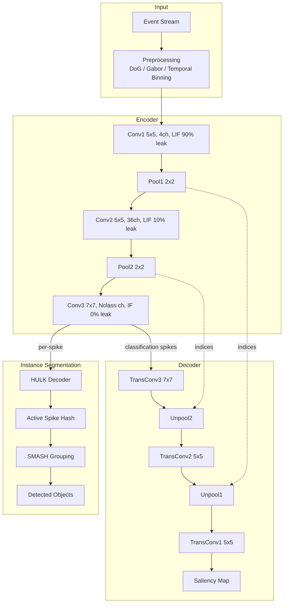

# Architecture Overview

SpikeSEG is a spiking encoder-decoder network with an instance-segmentation stage (HULK-SMASH) built on top of the encoder.

## Full Pipeline

## Layer Summary (IGARSS 2023)

| Layer | Type | Kernel | Channels | Threshold | Leak | Neuron |
|-------|------|--------|----------|-----------|------|--------|
| Conv1 | Spiking Conv2d | 5x5 | 4 | 10.0 | 9.0 (90%) | LIF subtractive |
| Pool1 | Max Pool | 2x2 | -- | -- | -- | -- |
| Conv2 | Spiking Conv2d | 5x5 | 36 | 10.0 | 1.0 (10%) | LIF subtractive |
| Pool2 | Max Pool | 2x2 | -- | -- | -- | -- |
| Conv3 | Spiking Conv2d | 7x7 | $n_\text{classes}$ | 10.0 | 0.0 | IF |

## Weight Initialization

All convolutional weights are drawn from $\mathcal{N}(0.8, 0.01)$ and clipped to $[0, 1]$. Starting near 1 accelerates STDP convergence.

## Two Output Paths

1. **Saliency map** (decoder path): all classification spikes are decoded together into a single pixel-level heat map.
2. **Instance masks** (HULK-SMASH path): each classification spike is decoded separately, producing one mask per instance, then grouped by SMASH similarity.

See [Encoder](architecture/encoder), [Decoder](architecture/decoder), [HULK-SMASH](architecture/hulk-smash).
