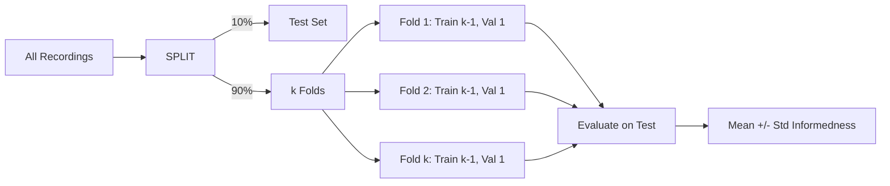

# Cross-Validation

SpikeSEG includes a k-fold cross-validation script for robust performance estimation.

## Quick Start

```bash
python scripts/train_cv.py \
  --config configs/config.yaml \
  --data-root /path/to/EBSSA \
  --n-folds 10 \
  --output-dir runs/cv
```

## How It Works

1. **Hold out 10%** of recordings as a test set (never touched during training).
2. Split the remaining 90% into $k$ folds.
3. For each fold: train on $k - 1$ folds, validate on the held-out fold.
4. After all folds: evaluate each fold's model on the test set.
5. Report mean $\pm$ std for validation and test metrics.



## CLI Arguments

| Flag | Default | Description |
|------|---------|-------------|
| `--config, -c` | `configs/config.yaml` | Config file |
| `--data-root, -d` | from config | EBSSA data root |
| `--n-folds, -k` | 10 | Number of folds |
| `--test-ratio` | 0.1 | Fraction held out for test |
| `--seed` | 42 | Random seed for splits |
| `--output-dir, -o` | `runs/cv` | Output directory |
| `--threshold` | 0.05 | Inference threshold |
| `--eval-only` | false | Only evaluate existing folds |

## Outputs

| Path | Content |
|------|---------|
| `fold_info.json` | Fold configuration and recording assignments |
| `test_recordings.txt` | Test set recording paths |
| `fold_{i:02d}/` | Per-fold training outputs (checkpoints, logs) |
| `cv_results.json` | Summary: val/test informedness mean, std, min, max |
