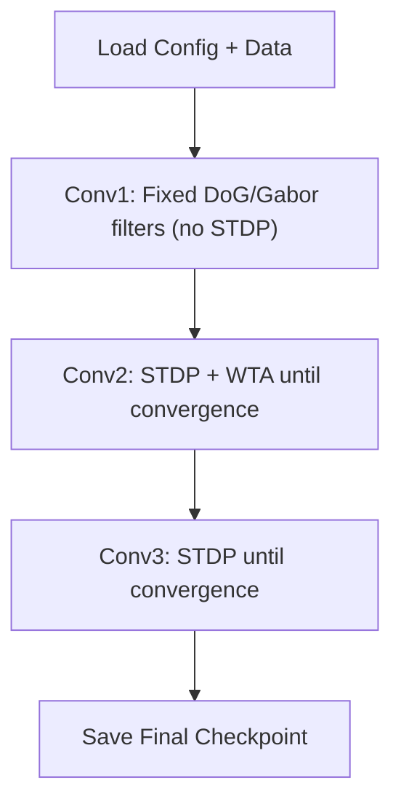

# Training Guide

SpikeSEG is trained with **unsupervised layer-wise STDP** and **Winner-Take-All** competition. No labelled data or backpropagation is needed.

## Quick Start

```bash
python scripts/train.py --config configs/config.yaml
```

## CLI Arguments

| Flag | Default | Description |
|------|---------|-------------|
| `--config, -c` | -- | Path to YAML config file |
| `--paper` | -- | Use a paper preset (`igarss2023`, `kheradpisheh2018`) |
| `--output, -o` | `./runs` | Output directory |
| `--name, -n` | auto | Experiment name |
| `--resume, -r` | -- | Checkpoint to resume from |
| `--epochs` | 50 | Maximum epochs per layer |
| `--n-classes` | 1 | Number of output classes |
| `--device` | `cuda` | Device (`cuda`, `cpu`, `cuda:0`) |
| `--seed` | 42 | Random seed |
| `--log-level` | `INFO` | `DEBUG`, `INFO`, `WARNING`, `ERROR` |
| `--no-tensorboard` | false | Disable TensorBoard logging |

## Layer-Wise Training Flow



1. **Conv1** uses fixed Difference-of-Gaussians (DoG) or Gabor filters. Set `train_conv1: false`.
2. **Conv2** is trained with STDP and WTA competition. After each sample, the WTA winner's receptive field weights are updated via STDP. Adaptive thresholds prevent dead neurons.
3. **Conv3** is trained similarly. This layer learns class-level features.

## Convergence

Training for each layer stops when:

- The convergence metric $C_l < 0.01$ (weights polarised to 0 or 1), **or**
- A target ratio of converged neurons is reached (default 90%), **or**
- Maximum epochs are exhausted.

## Outputs

| Path | Content |
|------|---------|
| `checkpoints/checkpoint_epoch{N}_{layer}.pt` | Per-epoch checkpoint |
| `checkpoints/checkpoint_best.pt` | Best checkpoint (lowest $C_l$) |
| `checkpoints/checkpoint_latest.pt` | Last checkpoint |
| `metrics_final.json` | Per-layer statistics (wins, weight stats, convergence) |
| `logs/` | Timestamped log files |
| `events/` | TensorBoard logs (if enabled) |

## Programmatic Training

```python
from spikeseg.models import SpikeSEG
from spikeseg.learning import STDPLearner, STDPConfig, WTAInhibition, WTAConfig, WTAMode

model = SpikeSEG.from_paper("igarss2023", n_classes=1)
config = STDPConfig.from_paper("igarss2023")
learner = STDPLearner(config)
wta = WTAInhibition(
    config=WTAConfig(mode=WTAMode.BOTH, local_radius=2, enable_homeostasis=True),
    n_channels=36, spatial_shape=(32, 32),
)

for epoch in range(50):
    for events, labels in dataset:
        model.reset_state()
        for t in range(10):
            output = model.encode(events[t])
            filtered, winner_mask = wta(
                output.layer_spikes['conv2'],
                output.layer_membranes['conv2'],
            )
            if winner_mask.any():
                learner.update_weights_for_winner(
                    model.encoder.conv2.weight,
                    pre_spike_times=output.layer_spike_times['conv1'],
                    post_spike_time=...,
                    winner_y=..., winner_x=...,
                    kernel_size=5,
                )
        if learner.has_converged(model.encoder.conv2.weight):
            break
```
