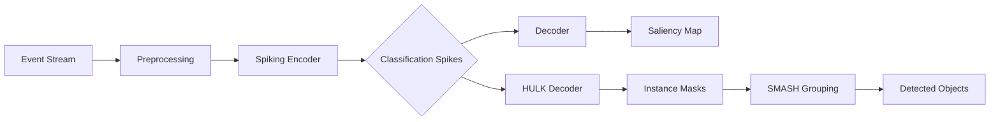

# Introduction

**SpikeSEG** is a PyTorch implementation of a biologically-inspired spiking neural network (SNN) for satellite detection and instance segmentation from event camera data. The system combines methods from four peer-reviewed publications to deliver a complete, unsupervised pipeline for neuromorphic space situational awareness.

## Motivation

Traditional frame-based cameras struggle in the space domain: satellites appear as faint, sub-pixel streaks against dense star fields, and conventional sensors saturate under rapid illumination changes. **Event cameras** (neuromorphic sensors such as ATIS and DAVIS) solve these problems by reporting per-pixel brightness changes asynchronously with microsecond resolution, high dynamic range, and virtually no motion blur.

SpikeSEG exploits the temporal structure of these event streams with a spiking neural network that learns features *without any labelled data* using Spike-Timing Dependent Plasticity (STDP).

## Contributions

This implementation provides:

1. **A three-layer spiking convolutional encoder** with Leaky Integrate-and-Fire (LIF) neurons, trained layer-wise via STDP with Winner-Take-All (WTA) competition.
2. **A tied-weight decoder** that maps classification spikes back to pixel space to produce saliency maps.
3. **The HULK-SMASH algorithm** for unsupervised instance segmentation: each classification spike is decoded individually (HULK), then instances are grouped into objects by comparing their Active Spike Hash (ASH) similarity and spatial overlap (SMASH score).
4. **Volume-based evaluation** following the IGARSS 2023 methodology, with informedness as the primary metric.

## Pipeline Overview

## Implemented Papers

| # | Paper | Year | Contribution |
|---|-------|------|-------------|
| 1 | Kheradpisheh et al. | 2018 | STDP learning rule, SNN architecture |
| 2 | Kirkland et al. | 2020 | SpikeSEG encoder-decoder, saliency mapping |
| 3 | Kirkland et al. | 2022 | HULK-SMASH instance segmentation |
| 4 | Kirkland et al. | 2023 | Space domain awareness, layer-wise leak (IGARSS) |

## Next Steps

- **[Installation](getting-started/installation)** -- set up SpikeSEG in your environment.
- **[Quick Start](getting-started/quickstart)** -- run a forward pass in five lines of code.
- **[Theoretical Background](theory/spiking-neurons)** -- understand SNNs, STDP, and WTA.
- **[Results](results)** -- evaluation methodology and performance metrics.
